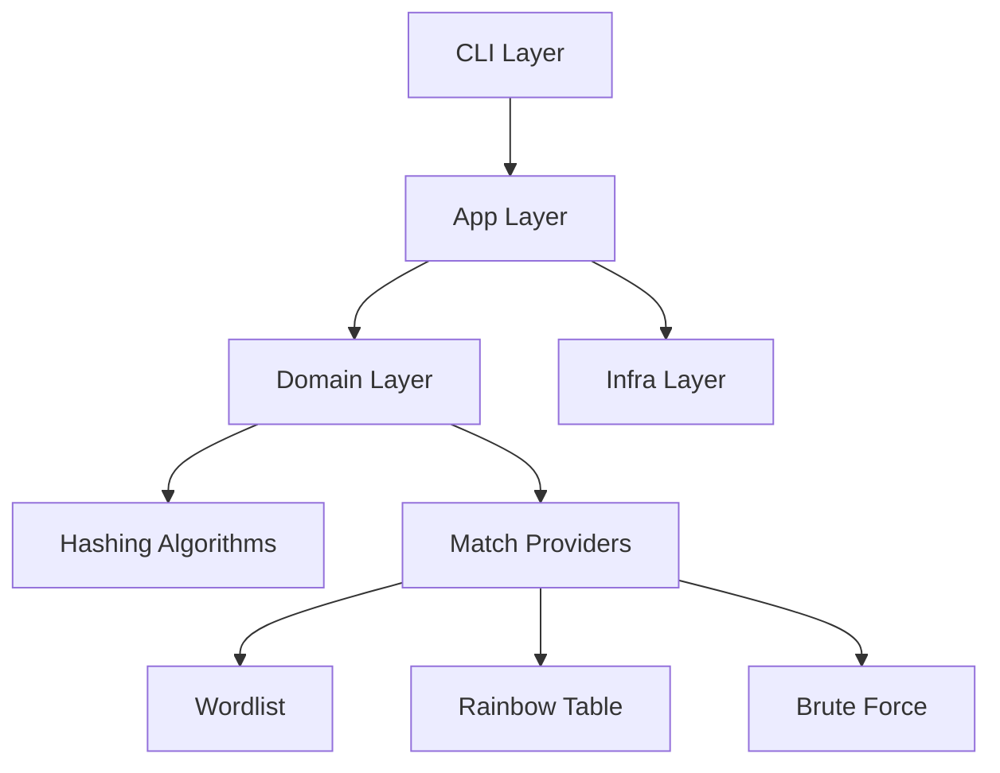

# Architecture Overview

Vox-Hash follows a clean, layered architecture to ensure maintainability, testability, and scalability.

## Layers

### 1. CLI Layer (`src/cli`)
- **args.rs**: Defines the command-line interface using `clap`. Centralizes all flags and subcommands.
- **validation.rs**: Performs cross-argument validation and enforces conflict rules before execution.

### 2. App Layer (`src/app`)
- **Use Cases**: Each CLI command has a corresponding use case function (e.g., `execute_dec`).
- Orchestrates the domain logic and handles I/O via the infra layer.

### 3. Domain Layer (`src/domain`)
- **hashing.rs**: Abstract interface for hashing algorithms (SHA1, MD5).
- **candidate_generation.rs**: Logic for generating brute-force candidates based on charsets and patterns.
- **decryption.rs**: Brute-force worker logic.
- **matching.rs**: Decryption orchestrator and match providers (wordlist, rainbow table, etc.).
- **models.rs**: Standardized data structures for results.

### 4. Infra Layer (`src/infra`)
- **file_io.rs**: Generic file read/write operations.

## Data Flow

1. **Input**: User provides arguments via the CLI.
2. **Parsing**: `clap` parses arguments into the `Cli` struct.
3. **Validation**: `validate_cli_args` checks for logical errors (e.g., min_len > max_len).
4. **Execution**: `main.rs` dispatches the command to the appropriate app use case.
5. **Processing**: The use case configures a `MatchingOrchestrator` with several `MatchProvider`s.
6. **Output**: Results are returned to `main.rs` and displayed in plain text or JSON format.

## Diagram (Mermaid)

